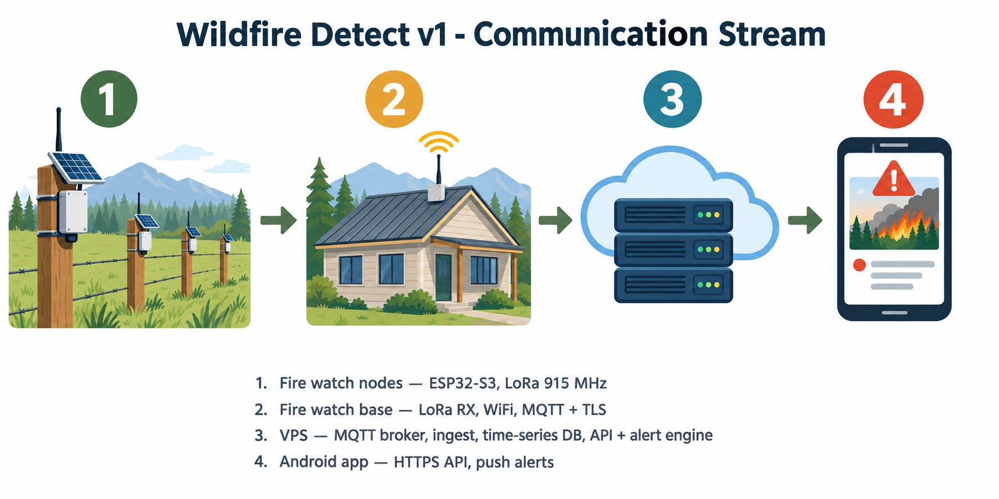

# Wildfire Detect v1 — Communication Stream

End-to-end data flow for the Nordtronics wildfire early-warning network, v1 product
architecture. One rule governs the whole design: **the phone app never talks to field
hardware. The VPS is the meeting point** — the base talks to the VPS, the app talks
to the VPS.

## The stream

```
[Fire watch node xN] --LoRa 915 MHz--> [Fire watch base] --WiFi, MQTT+TLS--> [VPS] --HTTPS API + push--> [Android app]
   field (property line)                    house                                  datacenter                    phone
```

### 1. Fire watch node (ESP32-S3, field)

- Samples: PMS5003 (PM2.5, primary smoke channel, duty-cycled to protect the
  deep-sleep power budget), BME680 (temperature/humidity/pressure fire-weather
  context + secondary VOC), AS3935 (lightning).
- Transmits readings via LoRa (915 MHz US ISM) to the base. Deep-sleep between
  cycles; hardware-autonomous cold-charge gate on the solar input (cuts charging
  near 0 C, restarts near 2.3 C).
- Honest physics: ~100 m effective detection radius per node.

### 2. Fire watch base (ESP32-S3, house)

- LoRa receiver for every node in its cell.
- Joins the customer's WiFi and publishes node telemetry via MQTT over TLS to the
  VPS broker. Same MQTT protocol as the prototype, re-addressed to the cloud.
- Install-time provisioning (WiFi credentials + account linking) via captive
  portal. No support call required.

### 3. VPS (rented Linux host, ~$5-6/mo, always on)

Four services on one small box:

- **MQTT broker** (Mosquitto) — the front door. Every base publishes here.
- **Ingest worker** — subscribes, validates, timestamps, writes every reading to
  the database.
- **Time-series database** — every reading, per node, timestamped. Pilot evidence
  accumulates here; this is the dataset shown to insurers.
- **API + alert engine** — HTTPS endpoints for the app (auth, device registration,
  node status/history, alerts). Runs the detection logic server-side: rate of
  change plus multi-node statistical consensus. On detection, sends a push
  notification to the phone (FCM).

### 4. Android app

- Talks to exactly one thing: the VPS API. Account, provisioning flow, node
  dashboard, reading history, push alerts.
- Never sees LoRa traffic; never touches the customer's LAN.

## Phase 1 prototype vs. product

The phase-1 prototype path (base -> local MQTT -> Home Assistant -> Pushover/SMS)
stays as the on-property proving ground. The phase-1 base *also* publishes to the
VPS: our own deployment is customer zero of the product backend. The pipeline
proves itself on our land before anyone pays.

## Privacy posture

- Data leaving the house is environmental telemetry only: PM2.5, temperature,
  humidity, pressure, VOC, battery voltage. No cameras, no microphones, no
  location trail. Collection and retention policy published.
- Remote alerting fundamentally requires data to leave the house — some server
  has to know to push to the phone. Stated plainly to customers, not dodged.
- **Local-only mode** for the opposed: the base does on-device thresholding, the
  app works over LAN, no away-from-home alerts. Customer's choice, tradeoff
  explicit.
- Server code published open-source. Transparency is the feature.

## Graphic prompt (for AI image generation)

> Clean flat technical system-architecture diagram, left-to-right data flow, white
> background, titled "Wildfire Detect v1 - Communication Stream". Four stages
> connected by arrows, each marked with a large numbered badge (1-4), NO text
> labels anywhere on the diagram itself: 1) small solar-powered sensor nodes
> mounted on fence posts in a grassy field; 2) a house with a small rooftop
> receiver unit; 3) a cloud server-rack icon; 4) a smartphone showing a wildfire
> alert notification. Leave clean empty space along the bottom for a legend to be
> added later. Icon-driven, professional IoT product-diagram style, muted greens
> and ambers, flat vector look, no photorealism.
>
> Legend (added manually after generation):
> 1. Fire watch nodes - ESP32-S3, LoRa 915 MHz
> 2. Fire watch base - LoRa RX, WiFi, MQTT + TLS
> 3. VPS - MQTT broker, ingest, time-series DB, API + alert engine
> 4. Android app - HTTPS API, push alerts

## Generated diagram



Generated 2026-09-23 from the merged prompt below. The generator rendered the
legend text cleanly, so the manual-legend fallback was not needed. If a future
regeneration mangles lettering, fall back to the no-text prompt variant plus a
manually added legend.
