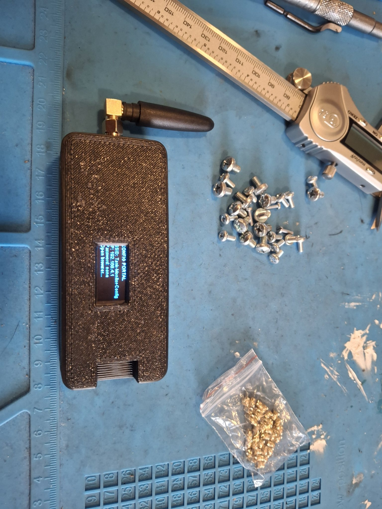
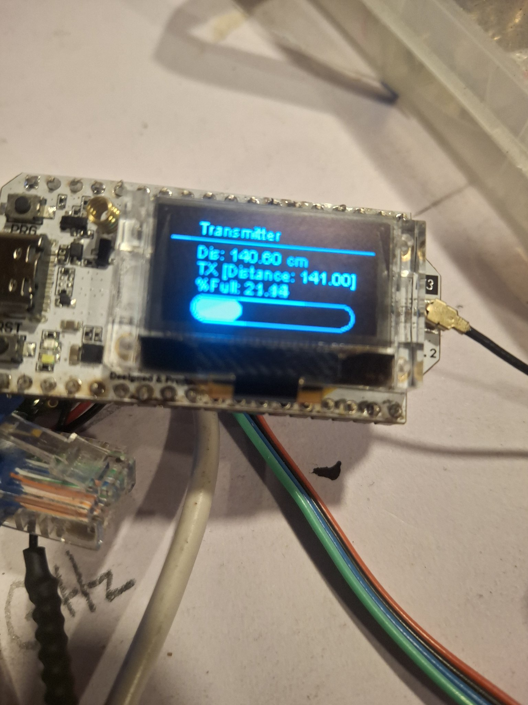
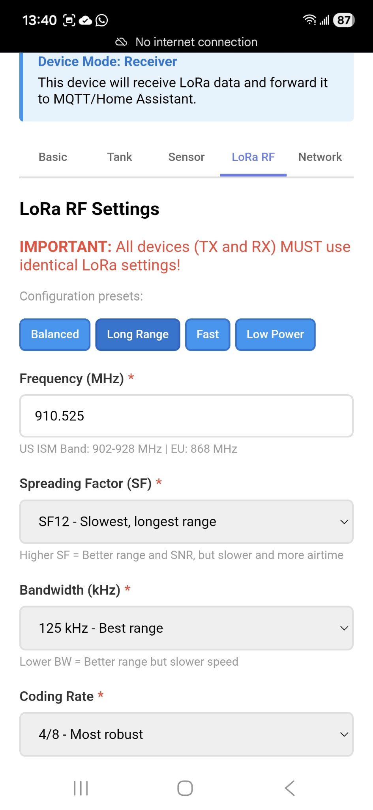
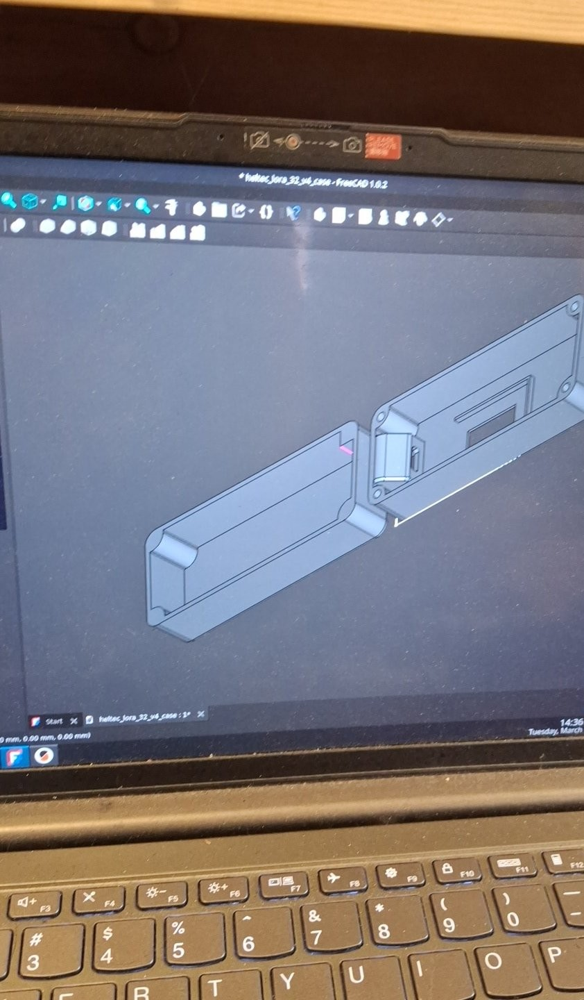

# Tank-Monitor — Remote Cistern Level Monitor

Wireless water-level monitoring for an off-grid cistern: a transmitter at the
tank measures the water level with an ultrasonic sensor and sends readings over
LoRa to a receiver at the house, which displays them and publishes to MQTT /
Home Assistant. Designed, built, and field-tested at an off-grid property in
Pagosa Springs, CO.

## How it works

One firmware image (`cistern_unified.ino`) runs on both ends. At boot it
auto-detects its role: if an ultrasonic sensor is found on GPIO 13/12 it
becomes the **transmitter**, otherwise the **receiver** (hold the PRG button
at boot to override manually).

- **Transmitter** — pings the ultrasonic sensor on a configurable interval
  (default 60 s), computes water level and percentage from the configured
  cistern height and sensor offset, and sends a JSON packet over LoRa
  (915 MHz default; configurable for 868/433 MHz regions) including the
  transmitter's battery voltage.
- **Receiver** — listens for LoRa packets, shows level, signal strength
  (RSSI) and remote battery voltage on the onboard OLED, and publishes
  everything to MQTT with Home Assistant auto-discovery, so the tank shows
  up as sensors in the HA dashboard with no manual configuration.
- **Setup** — first boot starts a WiFi captive portal for device name,
  cistern height, sensor offset, measure interval, MQTT broker/credentials/
  topic, and LoRa frequency/key. Settings persist across reboots.

## Hardware

- 2× Heltec LoRa 32 boards (ESP32 + LoRa radio + OLED display)
- Ultrasonic distance sensor (transmitter side)
- Battery-powered transmitter; voltage reported in every packet

## In this folder

- `cistern_unified.ino` — the unified transmitter/receiver firmware
  (Arduino framework; libraries: Heltec ESP32 Dev-Boards, WiFiManager,
  PubSubClient, ArduinoJson)

Related work: `../lora-display/` (LoRa radio experiments on Heltec LoRa V3
boards) and `../../python/ultrasonic-sensors/` (MicroPython ultrasonic
sensing prototypes with OLED/LCD output).

## Photos

## Project history

The deployed revision at the author's site (Tank-Monitor v2.2) runs on
ESP32-S3 + SX1262 hardware with a 3D-printed enclosure; this folder holds
the Heltec/Arduino iteration of the firmware.
