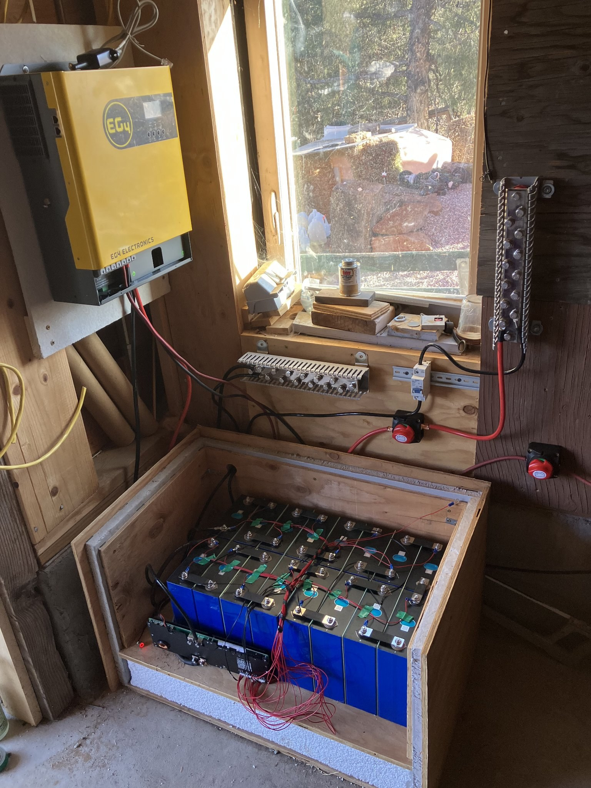

# Off-Grid Solar + Storage Installs

Off-grid solar system design and installation for cabins, RVs, and homes
around Pagosa Springs, CO — panels, inverter/chargers, and custom LiFePO4
storage, with full DC distribution done in-house.

## Representative setup

- **Inverter/charger** — EG4 inverter/charger
- **Storage** — custom-built LiFePO4 bank: prismatic cells, JK BMS,
  balance-lead harness, custom busbars, DC disconnects, custom enclosure
  (see `../../hardware/` for pack build details)
- **DC distribution** — full DC-side wiring, fusing/disconnects, and
  layout done in-house
- **Monitoring** — wireless tank/level sensors and Home Assistant
  integration where the site calls for it (see
  `../../firmware/cistern-monitor/`)

Detailed system specs available on request.
